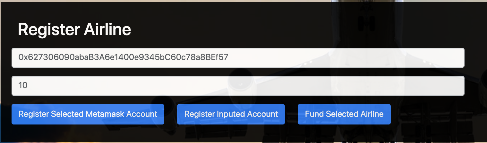
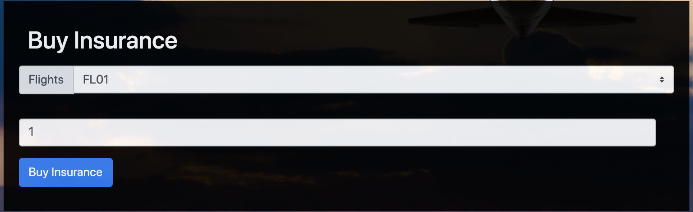
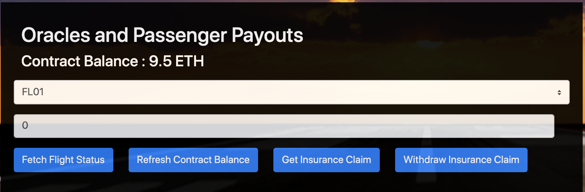
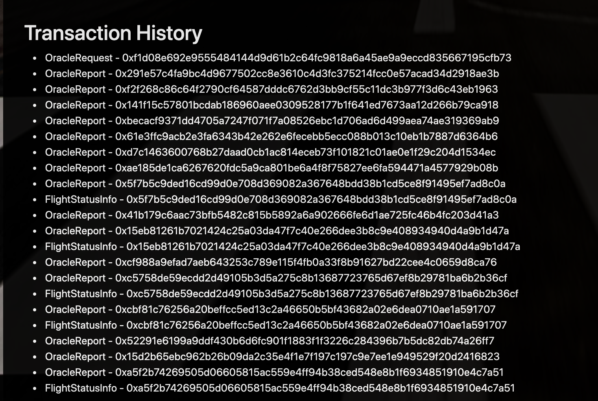

# FlightSurety

FlightSurety is a DAPP that tracks insurance claims for passengers that had their flights cancelled.

## Install

This repository contains Smart Contract code in Solidity (using Truffle), tests (also using Truffle), dApp scaffolding (using HTML, CSS and JS) and server app scaffolding.

To install, download or clone the repo, then:

`npm install`
`truffle compile`

## Develop Client

To run truffle tests:

`truffle test ./test/flightSurety.js`
`truffle test ./test/oracles.js`

To use the dapp:

`truffle migrate`
`npm run dapp`

To view dapp:

`http://localhost:8000`

## Develop Server

`npm run server`
`truffle test ./test/oracles.js`

## DAPP FLOW

Click this link to watch a short demo video of the DAPP
https://www.loom.com/share/7609ca6c2d6443b8a93b82b9f9de8155
1. This section allows a user to register an airline. An Airline can be registered in two ways, 
(i) by selecting a metamask account and clicking the first button, or (ii) by providing an ethereum address directly in the inputbox and clicking the second button.

Only after registering an airline can it be made to provide funds. To do that, input a fund amount in the second input, and click the "Fund Selected Airline" button.

2. A passenger can buy an insurance using this section. To do that, select a suitable metamask account that represents your first passenger, next select a Flight from the dropdown, provide an insurance amount, and then lastly click the Buy Insurance button.

3. In this section, you can simulate Fetching flight status, which triggers the listenening oracles to provide random flight statuses. After upto 3 oracles provide a status of 20, the logic that triggers insurance calculation would then be invoked. 
Click on Fetch Flight status and on another window watch the oracles provide response to the smart contract, if up to 3 provide the cancelled status, click on the "Get Insurance Claim" button to see how much is due. 
Next proceed to withdraw the amount using the last button.

4. Transaction logs are displayed here.

## Deploy

To build dapp for prod:
`npm run dapp:prod`

Deploy the contents of the ./dapp folder

## Resources

* [How does Ethereum work anyway?](https://medium.com/@preethikasireddy/how-does-ethereum-work-anyway-22d1df506369)
* [BIP39 Mnemonic Generator](https://iancoleman.io/bip39/)
* [Truffle Framework](http://truffleframework.com/)
* [Ganache Local Blockchain](http://truffleframework.com/ganache/)
* [Remix Solidity IDE](https://remix.ethereum.org/)
* [Solidity Language Reference](http://solidity.readthedocs.io/en/v0.4.24/)
* [Ethereum Blockchain Explorer](https://etherscan.io/)
* [Web3Js Reference](https://github.com/ethereum/wiki/wiki/JavaScript-API)